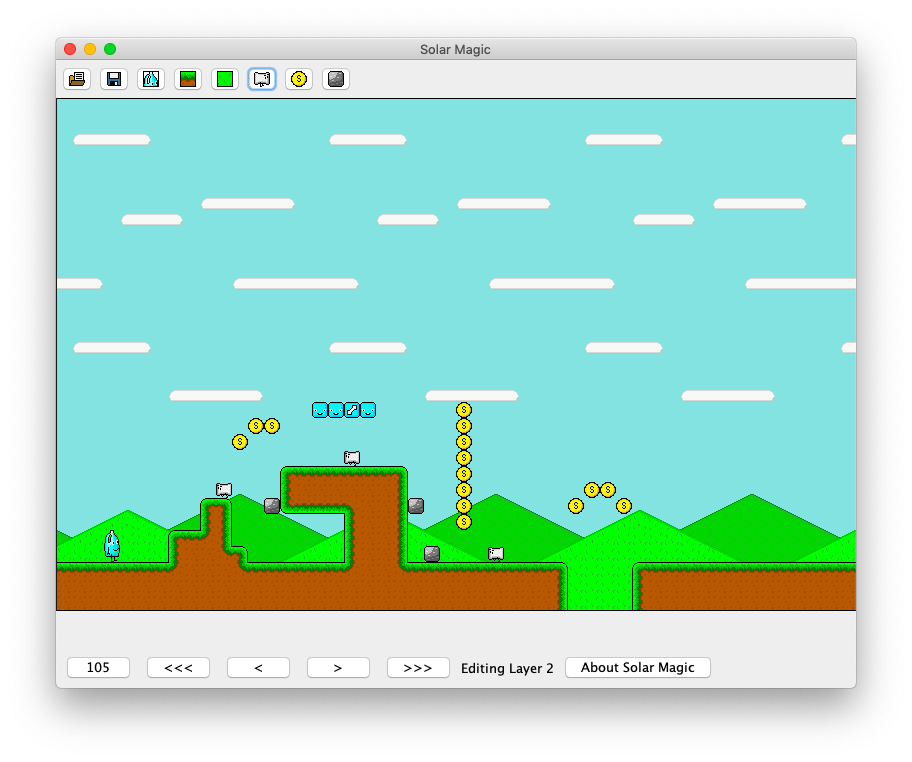
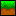
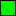

# Solar Magic
  A tool used for the modification of level files for 
  the game Soap Man's World.
  

  
  
### Playing Soap Man's World
Download `test game` and `Soap Mans World.jar`. Open the command line, and type the following:

`java -jar /path/to/Soap\ Mans\ World.jar /path/to/test\ game`

This will launch a new window that should briefly display "Bathroom Co. Presents"

>Notice: Java 1.8 or later should be installed.

>Notice: The console will say "The file cannot be loaded." This issue will be adressed, but for now can be ignored.
#### Controlling the game

Use the arrow keys to move Soapman around.
Use the space key to jump.
Use the up arrow to use an exit.
Use the escape key to reset.

## Editing Levels
Download `Solar Magic.jar` and double click it to open. 
To open a level folder, Navigate to it by clicking (), and using the inbuilt file searching feature. `test game` is a valid level and can be used

### Menu Bar

 - Load a level folder

 - Save a level

 - Switch to Sprite Layer editing

In this mode, you can move and delete sprites. To move it, hover mouse over sprite and drag it with the left button. To delete a sprite, right click it.

 - Switch to Layer 1 editing

 - Switch to Layer 2 editing

In these modes, you can paint tiles using the left mouse button. See below on how to select a tile.

 - Add a sprite

Currently, this opens a window with the prompt to enter a sprite ID. Currently, there are only 3 sprites. New sprites are added in the top left corner of the screen.

 - Switch and customize tiles

This opens a menu with all of the tiles loaded into the level. It also included a view of all the graphics inserted into the level.
You can change the tile's graphics using the `Set GFX` button. Each number corresponds the graphic of each corner. 
For convenience, a red square highlights the selected graphic for that corner. You can also set an action, which can either be

0: Nothing

1: Solid Block

2: Coin

3: Exit 1

4: Exit 2 

(Exits can be configured in settings.)

 - Load level settings

//This loads options that can be changed in the level. This includes the four tile graphics and four sprite graphics.
It also allows you to change the size of the level, determined by the value multiplied by 16. You can also configure
the levels that either exit 1 (Act as: 3) or exit 2 (Act as: 4) take you to.

### Footer Bar

The `<<<`, `<`, `>`, and `>>>` buttons are used to scroll the view. 

The number in the bottom left corner denotes the current level. Click it to change to a different level. Currently, the ability
to create levels has not been implemented (and probably won't be), so adding additional levels involves duplicating `./level/levelxxx.sml`

>Notice: Do not use the file under `./level/levelxxx.sml`. This file is for compatibility purposes and thus does not work.

## Compiling Notes
This project is recommended to be built with JavaSE-1.8, however JavaSE-1.6 was tested to be fully functional. `solarMagic` and `assets` are
both packages that are to be put inside of a source folder. The program included was compiled in Eclipse Photon form 2018, using JavaSE-1.6.
